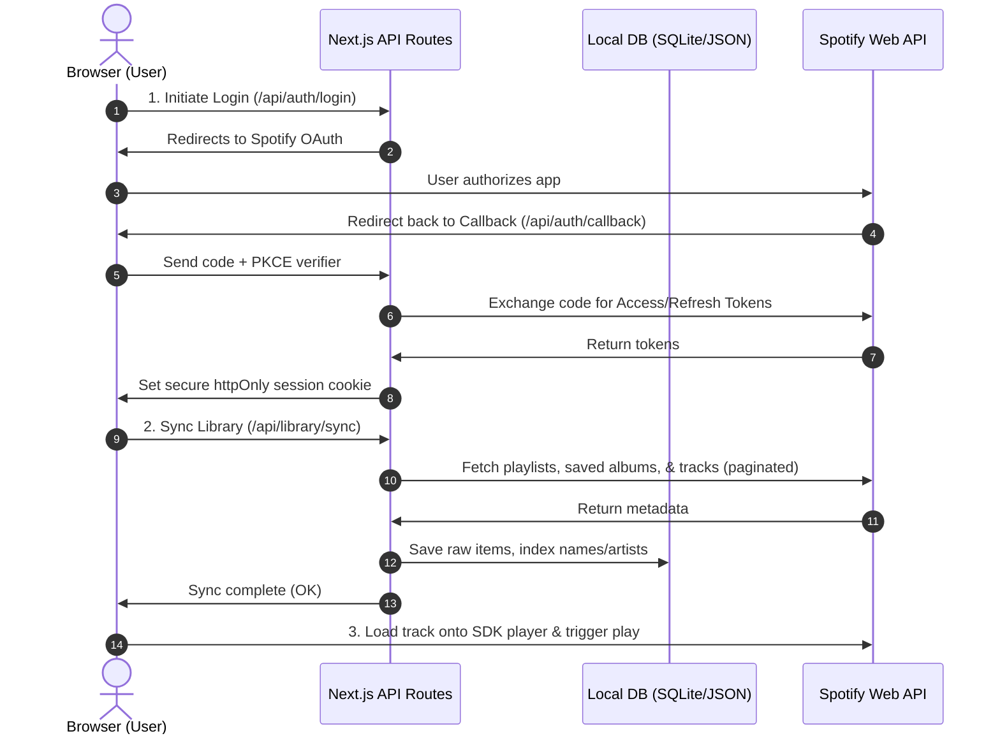

# Technical Design Document (TDD): Vinyl Booth

This document outlines the architectural blueprint, data flow, and phased milestones for building the **Vinyl Booth** web application. 

The goal is to deliver a functional, high-fidelity MVP rapidly using a Next.js (App Router) monolithic stack, avoiding unnecessary testing boilerplate while maintaining a clean, structured codebase.

> **Scope note (updated):** the Claude-backed "DJ" mood search is deferred. Current scope is Spotify integration only — auth, library fetch/cache, room rendering, and playback. The DJ search milestone stays documented below as a stub for later, but nothing in the near-term build depends on an Anthropic API key.

---

## 1. System Architecture & Data Flow



### Key Core Decisions
1. **Next.js App Router Monolith**: API routes serve as our backend. Environment variables (Spotify keys, session secrets) are stored securely on the server and never exposed to the client.
2. **Session Security**: Session tokens are encrypted and stored in secure, `httpOnly`, `SameSite=Lax` cookies using standard Next.js session helpers (e.g., `iron-session` or sealed cookies) to prevent XSS/CSRF token leakage.
3. **Database-less Caching (or Lightweight SQLite)**: Since the app is single-user/development mode, we will use a local SQLite file (`listening-cafe.db`) via `better-sqlite3` or a simple JSON file cache in the project directory to hold the user's library. This prevents hitting Spotify's rate limits on repeat page loads.

---

## 2. Data Model

To feed the LLM and match items quickly, we need to cache the user's Spotify library. The cache schema is simple:

### SQLite Tables (or JSON equivalent)

#### `playlists`
- `id` (TEXT, Primary Key): Spotify Playlist URI or ID.
- `name` (TEXT): Name of the playlist.
- `description` (TEXT): Spotify description.
- `track_count` (INTEGER): Number of tracks.
- `image_url` (TEXT): URL to the playlist cover art.

#### `albums`
- `id` (TEXT, Primary Key): Spotify Album URI or ID.
- `name` (TEXT): Album title.
- `artist` (TEXT): Primary artist.
- `image_url` (TEXT): Cover art.

#### `tracks`
- `id` (TEXT, Primary Key): Spotify Track URI or ID.
- `name` (TEXT): Track title.
- `artist` (TEXT): Artist name(s).
- `album_id` (TEXT, Foreign Key to albums): Nullable if playlist-only track.
- `playlist_id` (TEXT, Foreign Key to playlists): Nullable if album-only track.

---

## 3. API Endpoints Design

### Authentication
* **`GET /api/auth/login`**
  - Generates PKCE code verifier and challenge.
  - Stores verifier in an encrypted cookie.
  - Redirects to Spotify's authorize endpoint.
* **`GET /api/auth/callback`**
  - Receives authorization code from Spotify.
  - Exchanges code + verifier for tokens.
  - Saves tokens in a secure server session cookie.
  - Redirects back to `/` (home page).
* **`GET /api/auth/session`**
  - Returns current user details (e.g., display name, profile image) if authenticated.
  - Returns `401 Unauthorized` if no session exists.
* **`POST /api/auth/logout`**
  - Clears the session cookie.

### Library Sync
* **`POST /api/library/sync`**
  - Fetches all user playlists and saved albums from Spotify.
  - Overwrites/updates the local database cache.
  - Returns `{ status: "success", playlistsCount: X, albumsCount: Y }`.

### Semantic DJ Search — *deferred, not in current scope*
* **`POST /api/dj/search`** *(stub for later; requires `ANTHROPIC_API_KEY`)*
  - Request body: `{ query: "something lofi for working" }`
  - Logic:
    1. Loads all playlists and albums from the local database.
    2. Builds a lightweight summary: `[ { id: "...", type: "playlist", name: "...", artist/description: "..." } ]`.
    3. Sends summary + user query to Claude.
    4. Claude selects up to 6 matching items and writes a cozy response text.
  - Response:
    ```json
    {
      "djResponse": "Here's what I pulled from your shelves. A bit of lofi jazz and some chill beats to keep you focused.",
      "items": [
        { "id": "spotify:playlist:xxxx", "type": "playlist", "reason": "Lofi study beats" }
      ]
    }
    ```

### Player Proxy Controls
* **`POST /api/player/play`**
  - Request body: `{ uri: "spotify:playlist:xxxx", deviceId: "xxxx" }`
  - Sends a `PUT /v1/me/player/play` to Spotify with the active token to load and start playback.

---

## 4. Phased Milestones (Step-by-Step Build)

### Milestone 1: OAuth & Session Setup
Establish the secure Spotify login loop.
* **Success Criteria**: 
  - Clicking "Connect Spotify" redirects you to Spotify.
  - Authorizing redirects you back to `/`.
  - `/api/auth/session` successfully returns your Spotify profile JSON.
  - Access token refreshes automatically without forcing a re-login.

### Milestone 2: Library Fetching & Database Cache
Build the pagination logic to fetch and store playlists and saved albums.
* **Success Criteria**:
  - Hitting `/api/library/sync` fetches all user playlists/albums.
  - A database file `listening-cafe.db` is populated with correct schemas.
  - The API returns the correct count of imported items.

### Milestone 3: CSS Scene Layout & Record Sleeves
Build the 2D visual layout of the listening café room.
* **Success Criteria**:
  - Visual rendering of left/right speakers, columns, top horizontal shelf, and DJ center focal point.
  - Layout scales dynamically to fit the desktop viewport.
  - Vinyl records render with their cover arts (from the database).
  - Hovering/clicking a vinyl sleeve causes a CSS translation (slide out) and shows the title.

### Milestone 4: Turntable Integration & Web Playback SDK
Whip up the playback system using Spotify's Web Playback SDK.
* **Success Criteria**:
  - The browser successfully registers as an active Spotify Connect device ("Vinyl Booth").
  - Clicking a record from the shelf sends it to the active deck.
  - Playback commands (play, pause, skip) control the audio.
  - When music is playing, the turntable record spins (CSS rotation animation).

### Milestone 5: Deployment & Final Verification
Deploy to Vercel, wire up live keys, and verify.
* **Success Criteria**:
  - The project is live on Vercel.
  - The redirect URL is verified on both Vercel and the Spotify Developer Dashboard.
  - Logging in from a phone or alternative browser works seamlessly.

### Milestone 6 (deferred): DJ Semantic Match Route (Claude SDK)
Connect Anthropic Claude to process natural language queries over the cached data. **Out of scope until the Spotify integration above is solid** — revisit once Milestones 1–5 are done and you decide you want it.
* **Success Criteria**:
  - You can run a mock query through a tool like curl or a simple test endpoint.
  - The API returns a clean JSON with a custom DJ message and a list of real matching Spotify URIs found in your database.

---

## 5. Next Steps to Begin

1. **Spotify Setup**: Register an app at the [Spotify Developer Dashboard](https://developer.spotify.com/dashboard). Set the Redirect URI to `http://localhost:3000/api/auth/callback`.
2. **Project Variables**: Create a `.env.local` containing:
   ```env
   SPOTIFY_CLIENT_ID=your_spotify_client_id
   SPOTIFY_CLIENT_SECRET=your_spotify_client_secret
   SPOTIFY_REDIRECT_URI=http://localhost:3000/api/auth/callback
   SESSION_SECRET=a_random_32_character_string_for_session_encryption
   ```
   (No `ANTHROPIC_API_KEY` needed yet — add it later if/when Milestone 6 gets picked back up.)
3. Start **Milestone 1** by implementing the authentication routes in `/app/api/auth/`.
